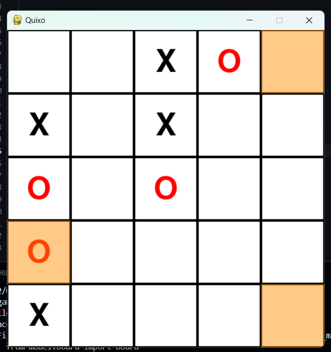

# 🟥 Quixo Game: Architecture & AI Strategy

This project is a high-fidelity Python implementation of the strategic board game **Quixo**. Developed with a strong focus on software engineering principles, it demonstrates the practical application of **Design Patterns** and **Heuristic Search Algorithms**.



## 🎮 Game Modes
* **Human vs Human:** Local multiplayer mode for two players.
* **Human vs AI:** Challenge a computer opponent powered by a strategic Minimax engine.

## 🏗️ Software Design Patterns
The application follows a modular architecture to ensure scalability and high-quality code organization:

1.  **MVC (Model-View-Controller):**
    * **Model:** Handles the core business logic, board state, and rules.
    * **View:** Manages the graphical interface and rendering using **Pygame**.
    * **Controller:** Orchestrates the flow, processing user inputs and updating the game state.
2.  **Singleton Pattern:** The `GameManager` is implemented as a Singleton to ensure a centralized, unique instance for managing game states and preventing data conflicts.
3.  **Strategy Pattern:** Used for player management. The game treats `HumanPlayer` and `AIPlayer` as interchangeable strategies, allowing for easy switching of game modes without modifying the core engine logic.


## 🧠 Artificial Intelligence: Minimax Algorithm
The AI opponent utilizes the **Minimax algorithm**, a recursive decision-making framework designed for zero-sum games.

### How it works:
* **Recursive Search Tree:** The AI simulates future moves by alternating between its own best moves (**Maximizing**) and the human player's best possible responses (**Minimizing**).
* **Heuristic Evaluation:** To optimize performance, the algorithm evaluates board states using a scoring system that analyzes:
    * **Alignment Strengths:** Weighting 3-in-a-row and 4-in-a-row patterns.
    * **Board Control:** Prioritizing edge cubes that maximize future movement options.
    * **Winning/Losing Paths:** Assigning extreme values to terminal states (5-in-a-row).
* **Rational Decision Making:** The AI selects the path that provides the highest guaranteed score regardless of the opponent's strategy.


## 📂 Project Structure
```text
.
├── src/
│   ├── controller/          # MVC Controller: Interaction logic
│   │   └── game_controller.py
│   ├── manager_singleton/   # Singleton Pattern: Global state management
│   │   └── game_manager.py
│   ├── model/               # MVC Model: Core logic & Strategy Pattern
│   │   ├── board.py
│   │   ├── player.py        # Base Strategy
│   │   ├── ai_player.py     # AI Strategy (Minimax)
│   │   └── human_player.py  # Human Strategy
│   ├── view/                # MVC View: Graphical interface
│   │   └── game_view.py
│   └── main.py              # Application entry point
├── documentation/           # Technical report and screenshots
└── requirements.txt         # Project dependencies
```
## 🛠️ Tech Stack
* **Language:** Python 3.x
* **GUI Library:** Pygame
* **Core Concepts:** Object-Oriented Programming (OOP), Design Patterns, Heuristic Search.

## ⚙️ Installation & Execution

### 1. Prerequisites
Ensure you have Python installed, then install the required library:
```bash
pip install pygame
```

### 2. Run the Game
Execute the main script from the project root:

```bash
python src/main.py
```

### 3. Basic Rules
Select a cube from the edge of the board (must be empty or your own symbol).

* "Push" the cube back into the board from one of the available sides of that row or column.

* The first player to align 5 symbols horizontally, vertically, or diagonally wins.

* Developed by Mustapha Genouiz at Avignon University. Focused on Software Engineering and AI optimization.

--- 
*Developed by Mustapha Genouiz at Avignon University. Focused on Software Engineering and AI optimization.*
